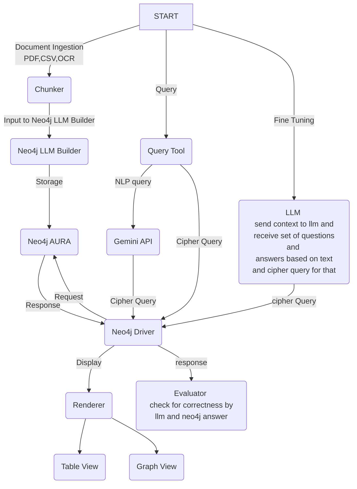

<div align="center">

# 🕸️ IndiaKG — Knowledge Graph Intelligence from Indian News

### *Turn raw news into structured, queryable intelligence — powered by LLMs and Graph Databases*

[](https://www.python.org/)
[](https://streamlit.io/)
[](https://neo4j.com/)
[](https://deepmind.google/technologies/gemini/)
<<<<<<< HEAD
=======

>>>>>>> 8935df2 (feat: modified readme)
</div>

---

## 🌟 What Is This?

**IndiaKG** is an end-to-end intelligent pipeline that ingests unstructured Indian news data — from scanned images and PDFs to CSVs — and transforms it into a richly connected, **queryable Knowledge Graph** stored in Neo4j.

Behind the scenes, Google Gemini validates your graph's accuracy, patches missing relationships, and converts plain English questions into precise Cypher queries — all through an intuitive Streamlit interface.

> **Think of it as giving your news data a brain.**  
> Instead of reading articles, you *query* them. Instead of searching, you *traverse* connections.

---

## ✨ Feature Highlights

<table>
<tr>
<td width="50%">

### 🗂️ Multi-Modal Ingestion
Ingest knowledge from virtually any source:
- **📷 OCR Images** — `.png`, `.jpg`, `.tiff` via Tesseract
- **📄 PDFs** — Full text extraction with PyMuPDF
- **📊 CSVs** — Chunked tabular data processing

</td>
<td width="50%">

### 🤖 LLM-Powered Intelligence
Let AI do the heavy lifting:
- **Natural Language → Cypher** query generation
- **Auto-validation** of graph completeness vs. source text
- **Auto-patching** of missing nodes and relationships
- Powered by **Google Gemini**

</td>
</tr>
<tr>
<td width="50%">

### 🔍 Flexible Query Interface
Query your graph your way:
- **Natural language** questions (no Cypher needed)
- **Pre-built templates**: single-hop, multi-hop, path, crime analysis, conjunctive
- **Raw Cypher** execution for power users

</td>
<td width="50%">

### 🧹 Graph Maintenance
Keep your graph clean and consistent:
- **Deduplication** of nodes sharing the same ID
- **Relationship normalization** (`MURDERED` → `KILLED`, `NABBED` → `ARRESTED`)
- Powered by Neo4j **APOC** plugin

</td>
</tr>
</table>

---

## 🗺️ System Architecture & Data Flow

The diagram below shows the complete end-to-end pipeline — from raw document ingestion all the way to graph querying, visualization, and LLM-powered fine-tuning:



**Three entry points, one unified graph:**
- **Ingestion path** — Documents are chunked and fed to the Neo4j LLM Builder, which extracts entities and relationships into Neo4j Aura
- **Query path** — Natural language questions flow through Gemini to become Cypher; raw Cypher queries go directly to the Neo4j Driver; results render as tables or interactive graphs
- **Fine-Tuning path** — Context is sent to the LLM, which generates Q&A pairs; answers are cross-checked against the live graph by the Evaluator to detect and patch gaps

---

## 📁 Repository Structure

```
IndiaKG/
│
├── 🟢 app.py                      # Streamlit application entry point
├── 🧹 cleanup.py                  # Graph deduplication & normalization
├── 📋 requirements.txt
├── 🔐 .env.example
│
├── input_files/                   # Data ingestion layer
│   ├── ocr_extractor.py           # Tesseract OCR for images
│   ├── pdf_extractor.py           # PyMuPDF text extraction
│   └── csv_extractor.py           # CSV scraping & chunking
│
├── utils/                         # Core business logic
│   ├── llm_query_generator.py     # Natural Language → Cypher (Gemini)
│   ├── query_extractor.py         # Neo4j query execution wrapper
│   ├── graph_renderer.py          # Interactive PyVis rendering
│   ├── gemini_evaluator.py        # LLM graph validation & auto-fix
│   └── schema_inspector.py        # Live schema introspection
│
├── query_templates/               # Reusable Cypher templates
│   ├── loader.py
│   ├── single_hop.py              # Direct neighbor queries
│   ├── multi_hop.py               # Multi-step traversals
│   ├── path_query.py              # Shortest paths & networks
│   ├── crime_analysis.py          # Domain-specific analytics
│   └── conjunctive.py             # Complex multi-condition queries
│
├── 📄 schema.txt                  # Master node/relationship definitions
└── ⚡ schema_cache.json           # Cached schema for fast loading
```

---

## 🚀 Getting Started

### Prerequisites

| Requirement | Version | Purpose |
|---|---|---|
| Python | 3.9+ | Runtime |
| Neo4j Aura | Latest | Graph Database (APOC plugin required) |
| Tesseract OCR | Any | Image text extraction |
| Google Gemini API Key | — | LLM reasoning & NL-to-Cypher |

### 1. Clone & Install

```bash
git clone https://github.com/your-username/IndiaKG.git
cd IndiaKG

python -m venv virtEnv
source virtEnv/bin/activate        # Windows: virtEnv\Scripts\activate

pip install -r requirements.txt
```

### 2. Configure Environment

Create a `.env` file in the project root:

```env
NEO4J_URI=neo4j+s://<your-db-id>.databases.neo4j.io
NEO4J_USERNAME=neo4j
NEO4J_PASSWORD=<your-password>
GEMINI_API_KEY=<your-gemini-api-key>
```

### 3. Launch

```bash
streamlit run app.py
```

Your browser will open automatically at `http://localhost:8501` 🎉

---

## 💡 Application Modes

### 🔍 Query Mode
> *Ask anything. Get answers from your graph.*

- Upload images, PDFs, or CSVs from the sidebar to ingest new data
- Ask questions in **plain English** — Gemini converts them to Cypher automatically
- Choose from pre-built **template queries** for common graph patterns
- Execute **raw Cypher** for full control
- View results as an **interactive graph** (PyVis) or a **data table**

---

### 🧪 Tune Mode
> *Teach your graph what it's missing.*

1. Paste a raw text chunk or upload a document
2. Gemini generates evaluation questions from the text
3. These questions are run against your Neo4j graph
4. Any missing nodes/relationships are **automatically detected and inserted**

This is how your graph grows smarter over time.

---

### 🗺️ Schema Mode
> *Understand what your graph knows.*

- View all **node labels** and **relationship types** in real time
- Inspect **property keys** and **node statistics**
- Get ready-to-copy **Cypher snippets** for common patterns

---

## 🧹 Graph Maintenance

Over time, duplicate nodes and inconsistent relationship naming can degrade query quality. Run the cleanup script periodically:

```bash
python cleanup.py
```

**What it does:**
- Merges duplicate nodes sharing the same `id` (uses APOC `apoc.refactor.mergeNodes`)
- Normalizes semantically equivalent relationships:

| Raw Relationship | Normalized To |
|---|---|
| `MURDERED`, `SHOT_DEAD`, `ELIMINATED` | `KILLED` |
| `ARRESTED_BY`, `DETAINED`, `NABBED` | `ARRESTED` |
| `WORKED_WITH`, `COLLABORATED` | `ASSOCIATED_WITH` |
| *(and more...)* | |

> ⚠️ Requires the **APOC plugin** enabled on your Neo4j instance.

---

## 🛠️ Tech Stack

| Layer | Technology |
|---|---|
| **Frontend** | Streamlit |
| **Graph Database** | Neo4j Aura (Cypher) |
| **LLM / AI** | Google Generative AI (Gemini) |
| **Graph Visualization** | PyVis |
| **OCR** | PyTesseract + Tesseract Binary |
| **PDF Parsing** | PyMuPDF (`fitz`) |
| **Data Processing** | Pandas, BeautifulSoup4 |
| **Graph Maintenance** | Neo4j APOC Plugin |

---

## 🔮 Roadmap

- [ ] Support for Hindi/regional language OCR
- [ ] Timeline-based graph filtering (date-range queries)
- [ ] Entity disambiguation using embeddings
- [ ] Export graph to GraphML / JSON-LD
- [ ] REST API layer for external integrations
- [ ] Docker-based one-click deployment

---

## 🤝 Contributing

Contributions are welcome! Please open an issue first to discuss what you'd like to change, then submit a pull request.

```bash
# Create a feature branch
git checkout -b feature/your-feature-name

# Commit your changes
git commit -m "feat: add your feature description"

# Push and open a PR
git push origin feature/your-feature-name
```


<div align="center">

**Built with ❤️ for understanding India's news landscape — one relationship at a time.**

*If this project helped you, consider giving it a ⭐ on GitHub!*

</div>
